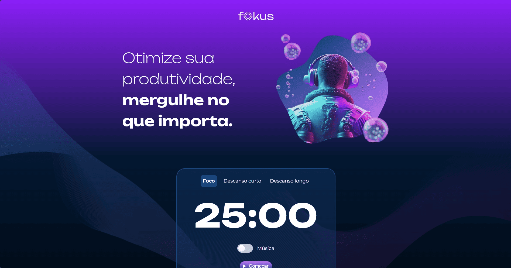

<h1 align="center">
  ⏱️ Fokus — Temporizador Pomodoro
</h1>

<p align="center">
  
  
  
  
</p>

O **Fokus** é uma aplicação web interativa projetada para otimizar a produtividade através da metodologia Pomodoro. O projeto foi desenvolvido como o desafio central do curso **"JavaScript: manipulando o DOM"** da **Alura**, consolidando técnicas essenciais de desenvolvimento front-end client-side.

A plataforma permite chavear entre três períodos customizados (Foco, Descanso Curto e Descanso Longo), adaptando dinamicamente a identidade visual da página, os cronômetros e disparando gatilhos sonoros imersivos.

<p align="center">  </p>

---

## 📌 Engenharia de Lógica & Manipulação do DOM

O arquivo `script.js` orquestra o comportamento reativo do sistema através de conceitos consolidados de manipulação de interfaces:

* **Chaveamento de Contexto Dinâmico:** Através do método `setAttribute('data-contexto', ...)` e da manipulação de tokens de classe (`classList`), o sistema altera o plano de fundo, os textos institucionais e a imagem em destaque com base no modo selecionado, sem necessidade de recarregar a página.
* **Orquestração da Web Audio API Nativa:** Integração de objetos de áudio (`new Audio()`) para enriquecer a experiência do usuário. O sistema gerencia uma trilha sonora de fundo em loop (controlada por um componente `<input type="checkbox" id="alternar-musica">`) e efeitos sonoros incidentais para ações de início, pausa e término do contador.
* **Gerenciamento de Fluxos Assíncronos (`setInterval`):** O motor do cronômetro regressivo utiliza a função `setInterval` para decrementar o tempo a cada 1000 milissegundos. A lógica conta com travas estritas (`clearInterval`) para pausar a execução e evitar a sobreposição de loops na memória do navegador.
* **Formatação Reativa de Tempo:** Uma função utilitária captura os segundos brutos em memória, realiza o tratamento temporal e os renderiza no formato padronizado `MM:SS` diretamente na tela utilizando interpolação de strings (*Template Literals*).

---

## 📂 Estrutura do Repositório

```text
fokus
├── imagens/            # Capas de contexto (foco, descanso), ícones e logos
├── sons/               # Arquivos de áudio (.mp3 e .wav) para feedbacks sonoros
├── index.html          # Estrutura semântica e nós de amarração do DOM
├── script.js           # Inteligência da aplicação (temporizadores, eventos e áudio)
└── styles.css          # Estilização global, tokens de cores e layouts responsivos

```

---

## 🚀 Como Executar o Projeto

Por se tratar de uma aplicação baseada inteiramente em recursos nativos do navegador (front-end puro), ela não necessita de prompts de comandos ou servidores de banco de dados para rodar:

1. Realize o clone deste repositório em seu ambiente local:
```bash
git clone https://github.com/cassia-nascimento/fokus.git

```


2. Entre na pasta do projeto:
```bash
cd fokus

```


3. Abra o arquivo `index.html` diretamente em seu navegador web preferido (Chrome, Firefox, Safari ou Edge).

---

## 👩‍💻 Autora

Projeto de imersão técnica e manipulação reativa web desenvolvido por **Cássia Nascimento**.

* [GitHub Profile](https://github.com/cassia-nascimento)
* [LinkedIn](https://www.linkedin.com/in/cassia--nascimento/)
